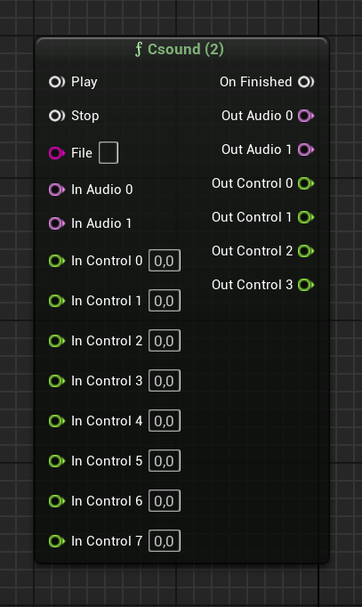

MetaCsoundProject
===========================================

MetaCsound is a plugin for [Unreal Engine](https://www.unrealengine.com/) that integrates the
audio signal processing engine [Csound](https://csound.com/) within the
[MetaSounds](https://dev.epicgames.com/documentation/en-us/unreal-engine/metasounds-in-unreal-engine) environment.
This integration results in a new set of available nodes for MetaSounds. When executed, they will create a new Csound
instance, compile the input Csound file, and start processing the resulting audio.

This repository is an Unreal project that includes the plugin.

Installing
----------------------------------------------
MetaCsound has been developed using Unreal Engine version 5.3.2 and Csound version 6.18.0.
Currently, it is only compatible with Windows machines.

1. **Install MetaSounds Plugin**: First, you need to install the MetaSounds plugin in your project, since MetaCsound
depends on it. You can do this by searching for it in **Edit -> Plugin Manager**.

2. **Ensure Csound is Installed**: Make sure that the correct version of Csound is installed in the default location.

3. **Copy MetaCsound Folder**: Download the MetaCsound folder from this repository and copy it into the plugin
folder of your project.

4. **Compile the Code**: Close the Unreal Editor and compile the code (most Windows users will use Visual Studio for this).
Do not use Unreal Editor's live coding feature for the first compilation with the plugin.

5. **Setup Csound Files**: Open the Editor. In your project content folder, create a new folder called `CsoundFiles`.
Place your `.csd` files here or in subfolders.

6. **Verify Node Availability**: To check if the new nodes are available, create a new MetaSounds graph and try to add
some of the new nodes from the drop-down menu, such as `Csound (2)`.

Using
----------------------------------------------
Using MetaCsound is straightforward. In your MetaSounds graph, simply add one of the available Csound nodes.
All nodes have a similar layout, differing only in the number of input and output audio and control channels.

- **Play**: Compiles the Csound file and starts performing. If an error occurs, a message will appear in the console.
Triggering Play again will restart the performance.

- **Stop**: Stops the Csound performance. This will trigger `On Finished`.

- **On Finished**: Triggered when the performance stops, either due to a `Stop` trigger or the Csound performance ending.
To keep the performance running continuously, add `f0 z` to the score section of your `.csd` file.

- **File**: The name of the `.csd `file to be performed. This file must be placed in the `CsoundFiles` folder
within the `Content` folder of your project. Subdirectories are allowed and should be specified using the `/` character to
indicate the relative path. Do not include the `.csd` extension in the filename. For example, specifying `Subdirectory/Test`
corresponds to the file `/Content/CsoundFiles/Subdirectory/Test.csd`.

- **In Audio X**: Input audio channel. The number of input channels in the `.csd` file is determined by defining `nchnls_i`,
or defaults to `nchnls` if not explicitly defined. Csound can handle fewer channels than the node allows but cannot handle more.
Use a MetaSound node with more audio inputs if needed. In the `.csd` files, input audio channels can be accessed using
opcodes like `in` or `ins`.

- **Out Audio X**: Output audio channel. The number of output channels in the `.csd` file is determined by defining `nchnls`.
Csound can handle fewer channels than the node allows but cannot handle more. Use a MetaSound node with more audio outputs
if needed. In the `.csd` files, output audio channels can be written using opcodes like `out` or `outs`.

- **In Control X**: Input control channel. The control channel can be accessed from Csound using a control bus, defined with
the same name as the corresponding MetaSounds pin. Define it in Csound using `chn_k "In Control X", 1`, where X is the input number.
The value can be read using the opcode `chnget`.

- **Out Control X**: Output control channel. The control channel can be accessed from Csound using a control bus, defined with
 the same name as the corresponding MetaSounds pin. Define it in Csound using `chn_k "Out Control X", 2`, where X is the output number.
 The value can be written using the opcode `chnset`.

Examples
----------------------------------------------
Examples can be found in this repository. Three MetaSound graphs are located in `Content/MetaSounds`.
Their corresponding `.csd` files are in `Content/CsoundFiles`.

Packaging your game
----------------------------------------------
The Csound .dll file is not included in the packaged game. This means new users will need to install Csound separately.

Before packaging the game, an additional configuration is required. In the Editor, go to
`Edit -> Project -> Settings -> Packaging -> Additional Non-Asset Directories To Copy`. This option is an array that
is initially empty. Add a new element with the value `CsoundFiles`. This step is necessary to include your `.csd` files
in the final packaged game.
 
License
----------------------------------------------

	Copyright (C) 2024 Albert Madrenys Planas

	This software is free software; you can redistribute it and/or
	modify it under the terms of the GNU Lesser General Public
	License as published by the Free Software Foundation; either
	version 2.1 of the License, or (at your option) any later version.

	This software is distributed in the hope that it will be useful,
	but WITHOUT ANY WARRANTY; without even the implied warranty of
	MERCHANTABILITY or FITNESS FOR A PARTICULAR PURPOSE.  See the GNU
	Lesser General Public License for more details.

	You should have received a copy of the GNU Lesser General Public
	License along with this software; if not, write to the Free Software
	Foundation, Inc., 59 Temple Place, Suite 330, Boston, MA 02111-1307 USA
